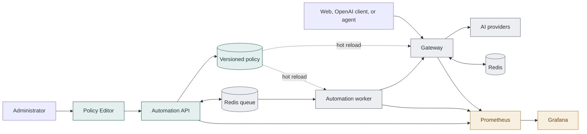

# PolyGate

[English](./README.md) | [简体中文](./README.zh-CN.md)

> **An AI API control plane for teams.** One endpoint for developers. One policy
> plane for the organization.

Applications keep the OpenAI-compatible interface they already know. PolyGate
reads the current organizational policy, decides when and where work runs, and
records why.

**Control decides. Execution enforces. Observability proves.**

The project ranked first in the NUS Cloud Computing course project evaluation.

| Web Console | Operations Dashboard |
|---|---|
|  |  |

## Why a control plane?

Many teams begin with provider keys and a shared budget. That setup works until
several applications depend on it and operational rules start to accumulate.

- Sensitive data must stay inside an approved boundary.
- Different workloads need different model capabilities and quality levels.
- Provider health, latency, and price change independently.
- Urgent work should move first without starving routine jobs.
- Every exception, override, retry, and fallback needs an owner and an audit
  trail.

Policies copied into individual applications soon drift apart. A thin gateway
centralizes traffic, but it still needs a clear way to manage conflicting
rules. PolyGate borrows the separation used in packet networks: one plane
computes policy, another executes it, and telemetry records the outcome.

| Packet networks | PolyGate |
|---|---|
| Control plane computes routes | Control plane publishes versioned organizational policy |
| Data plane forwards packets | Execution plane schedules and routes AI work |
| Telemetry reports network behavior | Observability records decisions, cost, latency, and drift |

PolyGate treats AI requests as shared workloads that need consistent routing.

## One policy, two decisions

For each request, PolyGate answers two questions:

1. **Who runs next?** The Automation worker orders queued jobs by urgency, then
   ages waiting work so lower-priority jobs cannot starve.
2. **Where should the work run?** The Gateway evaluates the same ordered route:
   privacy and capability are hard gates; health, budget, and latency filter the
   candidates; quality selects the winner.

The decision result includes the chosen provider, a human-readable reason,
estimated cost, latency, retries, failover state, and request ID. Queueing and
routing can change together when a new policy is published while the client
request remains unchanged.

## Architecture



- **Control plane:** policy validation, simulation, publication, rollback, and
  asynchronous intent compilation.
- **Execution plane:** an OpenAI-compatible Gateway, priority worker, provider
  adapters, cache, retries, circuit breakers, and pre-response failover.
- **Observability plane:** Prometheus metrics, Grafana dashboards, redacted
  Decision Records, and policy-version drift detection.

## Quick start

The default stack uses deterministic mock providers, so it can be explored
without an external model key or API charges.

```bash
cp .env.example .env
docker compose up --build -d
docker compose ps
```

The following services should become healthy:

| Service | URL | Purpose |
|---|---|---|
| Web Console | <http://localhost:8080> | Multi-turn chat and decision cards |
| Gateway | <http://localhost:8000> | OpenAI-compatible API |
| Automation API | <http://localhost:8020/docs> | Templates, previews, jobs, and policy lifecycle |
| Policy Editor | <http://localhost:8020/admin/policies> | Private validate/preview/publish/rollback interface |
| Monitoring API | <http://localhost:8010/api/monitoring/overview> | Curated Prometheus queries as JSON |
| Prometheus | <http://localhost:9090/targets> | Metrics and target health |
| Grafana | <http://localhost:3000/d/polygate-overview/polygate-overview> | Request, cost, reliability, and policy dashboards |

Send a policy-aware request through the same OpenAI-compatible surface an
existing client would use:

```bash
curl http://localhost:8000/v1/chat/completions \
  -H 'Content-Type: application/json' \
  -d '{
    "model": "auto",
    "messages": [{"role": "user", "content": "Summarize this incident."}],
    "polygate": {
      "privacy": "standard",
      "quality": "balanced",
      "latency_target_ms": 3000,
      "max_cost_usd": 0.01
    }
  }'
```

The response carries the model answer and a `polygate` decision card. A
corresponding redacted Decision Record can be queried by request ID while its
Redis TTL is active.

To enable the real DeepSeek adapters, set `REAL_A_API_KEY` in `.env`. The
mock providers remain the recommended path for local development and automated
verification.

## Policy lifecycle

Policy changes use this release path:

```text
edit -> validate -> simulate/preview -> publish -> hot reload -> converge
                                                        \-> rollback
```

Policy writes go through Automation. Gateway and Worker read the policy,
validate the complete document, and atomically swap versions. If Automation is
temporarily unavailable, they continue serving with the Last Known Good policy.

## Verification gates

### Backend

Use Python 3.12. Worker tests require a real Redis instance on an isolated
database. Gateway cache tests also require Redis; check the skip count as well
as the failure count.

```bash
AUTOMATION_TEST_REDIS_URL=redis://127.0.0.1:6379/15 \
  python -m pytest automation/tests -q

cd gateway
python -m pytest tests -q
cd ..
```

### Web

```bash
cd web
npm test
npm run lint
npm run build
cd ..
```

The supported Web test runtime is Node 22. Node 25's experimental
`localStorage` conflicts with jsdom and is not part of the verified toolchain.

### Contracts, deployment, and behavior

```bash
python3 scripts/tests/test-automation-contracts.py
python3 scripts/tests/test-policy-contracts.py
bash scripts/tests/test-deployment-automation.sh
bash scripts/tests/test-deployment-policy.sh
./scripts/kubernetes-monitoring-preflight.sh

./scripts/web-smoke-test.sh
./scripts/kubernetes-automation-smoke-test.sh
./scripts/automation-peak-test.sh
```

See [Gateway](./gateway/README.md),
[Automation](./automation/README.md), and
[Kubernetes deployment](./deploy/README.md) for component-specific gates and
operational caveats.

## Repository map

| Path | Responsibility |
|---|---|
| `gateway/` | OpenAI-compatible API, routing, cache, reliability, and Decision Records |
| `providers/` | Real and fault-injectable mock provider adapters |
| `automation/` | Intent/preview/job APIs, worker scheduling, and policy lifecycle |
| `web/` | Chat console, route preferences, and decision cards |
| `agent/`, `.pi/extensions/` | Agent boundary and Pi integration |
| `contracts/` | Cross-component JSON Schemas, examples, policy, and provider registry |
| `deploy/`, `monitoring/` | Compose, Kubernetes/EKS, Prometheus, and Grafana assets |
| `scripts/` | Contract, deployment, smoke, and load verification |

Component documentation:

- [Gateway](./gateway/README.md) · [Providers](./providers/README.md)
- [Automation Service](./automation/README.md) · [Contract Registry](./contracts/README.md)
- [Web Console](./web/README.md) · [Agent and Pi integration](./agent/README.md)
- [Kubernetes deployment](./deploy/README.md)
- [Local monitoring](./monitoring/README.md) · [Kubernetes monitoring](./deploy/monitoring/README.md)

## Security and operational boundaries

- The schemas and examples under `contracts/` define the shared interfaces.
  Interface changes should update the implementations and contract tests in the
  same commit.
- Never commit `.env`, cloud credentials, provider API keys, Grafana passwords,
  or real user prompts.
- `privacy=high` requests must not route to providers marked `external`.
- Policy Editor and monitoring surfaces are administrative tools; deployment
  manifests keep them off the public application entry point.
- Decision Records are redacted, authenticated when Gateway auth is enabled,
  and expire from Redis. Prompts, tool arguments, credentials, upstream URLs,
  and raw errors are not stored in them.
- Each Gateway replica currently keeps its own circuit-breaker state; replicas
  do not share it.

## The wider AI service network

PolyGate currently places a control plane around the AI traffic of one
organization. The same interfaces can also connect a larger system.

Organizations can publish policy constraints. Providers and in-house clusters
can report capability, locality, cost, and health. Shared exchange points can
use that information to route work across execution domains without putting
provider-specific rules back into client applications.


*Service-network concept from the original PolyGate presentation.*

In this model, an internal gateway serves as a routing node and policy planes
can coordinate across organizational boundaries. PolyGate brings its existing
policy lifecycle, execution boundary, and decision telemetry into that network.

## License

PolyGate is licensed under the [Apache License 2.0](./LICENSE). Contributions
are accepted under the same license. Copyright 2026 PolyGate contributors.
