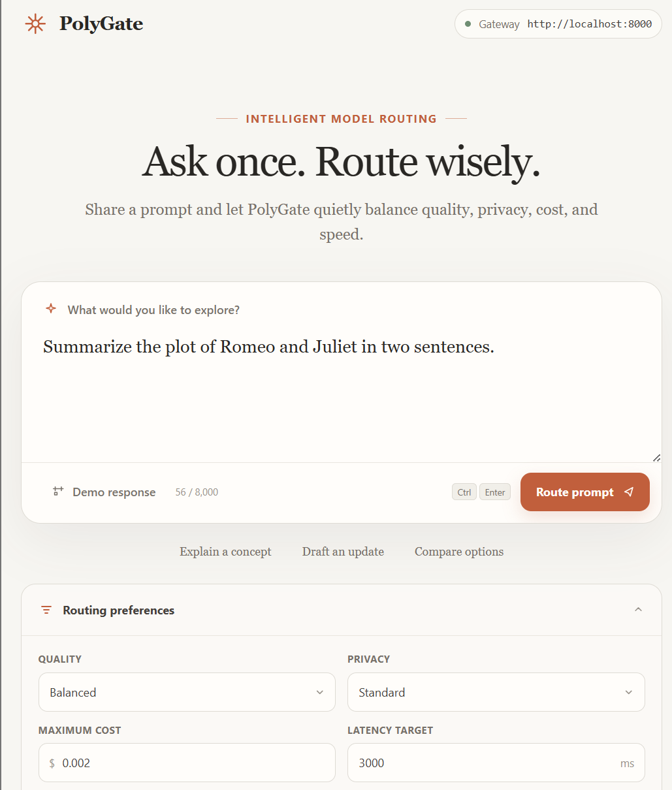
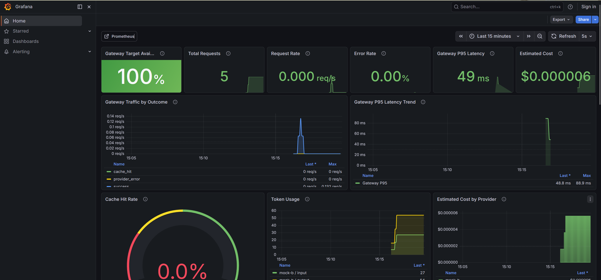
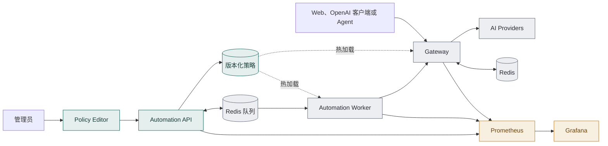
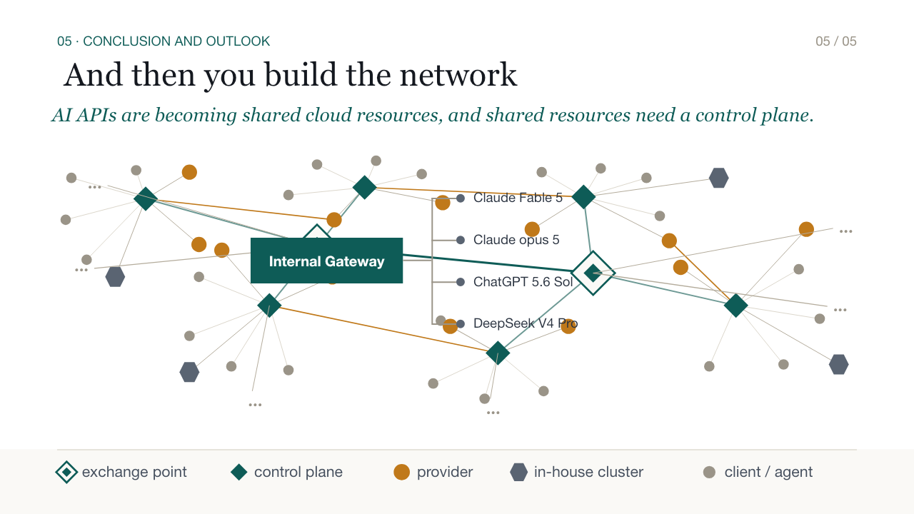

# PolyGate

[English](./README.md) | [简体中文](./README.zh-CN.md)

> **面向团队的 AI API 控制平面。**面向开发者，一个端点；面向组织，一套策略平面。

客户端继续使用熟悉的 OpenAI 兼容接口。PolyGate 读取当前组织策略，决定任务的执行
顺序和目标 Provider，并记录选择原因。

**控制平面负责决策，执行平面负责落实，可观测平面负责证明。**

PolyGate 在 NUS Cloud Computing 课程项目评选中获得第一名。

| Web 控制台 | 运维仪表盘 |
|---|---|
|  |  |

## 为什么需要控制平面？

不少团队一开始只需要发放几个 API Key，再设置一笔共享预算。随着接入的应用增加，
隐私、成本、延迟和故障处理规则也会跟着增加。

- 敏感数据必须留在获批的安全边界内；
- 不同工作负载需要不同的模型能力与质量；
- Provider 的健康状态、延迟和价格会独立变化；
- 紧急任务应当优先执行，但日常任务不能因此永远挨饿；
- 每项例外、覆盖、重试和故障切换都需要明确的责任归属与审计记录。

规则分散在各个应用中，很快就会出现不同版本。把流量集中到网关可以解决入口问题，
但冲突的规则仍然需要一套清楚的管理方式。PolyGate 借鉴分组网络的分层方式：控制
平面计算策略，执行平面落实策略，可观测系统记录结果。

| 分组网络 | PolyGate |
|---|---|
| 控制平面计算路由 | 控制平面发布版本化组织策略 |
| 数据平面转发分组 | 执行平面调度并路由 AI 工作 |
| 遥测系统报告网络行为 | 可观测平面记录决策、成本、延迟与版本漂移 |

PolyGate 把 AI 请求当作共享工作负载来统一路由。

## 一份策略，两个决策

系统收到请求后要回答两个问题：

1. **谁先运行？** Automation Worker 根据紧急程度安排队列，同时随着等待时间增加
   任务优先级，避免低优先级任务长期饥饿。
2. **工作在哪里运行？** Gateway 让请求依次通过同一条路由路径：隐私和能力是硬
   门禁，健康状态、预算与延迟负责筛选候选项，质量策略选出最终执行方。

最终结果包含所选 Provider、可读的选择原因、成本估算、延迟、重试次数、故障切换
状态和 Request ID。发布新策略后，调度与路由可以同步变化，而客户端请求保持不变。

## 架构



- **控制平面：**策略校验、模拟、发布、回滚，以及异步 Intent 编译；
- **执行平面：**OpenAI 兼容 Gateway、优先级 Worker、Provider 适配器、缓存、
  重试、熔断和响应开始前的故障切换；
- **可观测平面：**Prometheus 指标、Grafana 仪表盘、脱敏 Decision Record 和策略
  版本漂移检测。

## 快速开始

默认技术栈使用确定性 Mock Provider，无需外部模型 Key，也不会产生 API 费用。

```bash
cp .env.example .env
docker compose up --build -d
docker compose ps
```

以下服务应当进入健康状态：

| 服务 | 地址 | 用途 |
|---|---|---|
| Web 控制台 | <http://localhost:8080> | 多轮对话与决策卡片 |
| Gateway | <http://localhost:8000> | OpenAI 兼容 API |
| Automation API | <http://localhost:8020/docs> | 模板、Preview、Job 与策略生命周期 |
| Policy Editor | <http://localhost:8020/admin/policies> | 私有的校验、预览、发布与回滚界面 |
| Monitoring API | <http://localhost:8010/api/monitoring/overview> | 经过整理的 Prometheus 查询结果 |
| Prometheus | <http://localhost:9090/targets> | 指标与采集目标健康状态 |
| Grafana | <http://localhost:3000/d/polygate-overview/polygate-overview> | 请求、成本、可靠性与策略仪表盘 |

通过现有 OpenAI 客户端也可以使用的兼容接口，发送一条带策略约束的请求：

```bash
curl http://localhost:8000/v1/chat/completions \
  -H 'Content-Type: application/json' \
  -d '{
    "model": "auto",
    "messages": [{"role": "user", "content": "Summarize this incident."}],
    "polygate": {
      "privacy": "standard",
      "quality": "balanced",
      "latency_target_ms": 3000,
      "max_cost_usd": 0.01
    }
  }'
```

响应同时携带模型答案与 `polygate` 决策卡片。在 Redis TTL 有效期内，还可以通过
Request ID 查询对应的脱敏 Decision Record。

如需启用真实 DeepSeek 适配器，请在 `.env` 中配置 `REAL_A_API_KEY`。本地开发与
自动化验证仍推荐使用 Mock Provider。

## 策略生命周期

策略变更按下面的顺序发布：

```text
编辑 -> 校验 -> 模拟/预览 -> 发布 -> 热加载 -> 收敛
                                      \-> 回滚
```

策略写入统一经过 Automation。Gateway 和 Worker 读取并校验完整策略，再以原子方式
切换版本。Automation 暂时不可用时，它们会继续使用 Last Known Good 策略。

## 验证闸门

### 后端

请使用 Python 3.12。Worker 测试需要一个使用独立数据库的真实 Redis；Gateway 缓存
测试同样依赖 Redis，检查结果时要同时留意失败数和跳过数。

```bash
AUTOMATION_TEST_REDIS_URL=redis://127.0.0.1:6379/15 \
  python -m pytest automation/tests -q

cd gateway
python -m pytest tests -q
cd ..
```

### Web

```bash
cd web
npm test
npm run lint
npm run build
cd ..
```

Web 测试支持 Node 22。Node 25 的实验性 `localStorage` 会与 jsdom 冲突，不属于
已经验证的工具链。

### 契约、部署与行为

```bash
python3 scripts/tests/test-automation-contracts.py
python3 scripts/tests/test-policy-contracts.py
bash scripts/tests/test-deployment-automation.sh
bash scripts/tests/test-deployment-policy.sh
./scripts/kubernetes-monitoring-preflight.sh

./scripts/web-smoke-test.sh
./scripts/kubernetes-automation-smoke-test.sh
./scripts/automation-peak-test.sh
```

组件级验证与运维边界请参阅 [Gateway](./gateway/README.md)、
[Automation](./automation/README.md) 和
[Kubernetes 部署](./deploy/README.md)。

## 仓库结构

| 路径 | 职责 |
|---|---|
| `gateway/` | OpenAI 兼容 API、路由、缓存、可靠性与 Decision Record |
| `providers/` | 真实 Provider 与可注入故障的 Mock Provider 适配器 |
| `automation/` | Intent/Preview/Job API、Worker 调度与策略生命周期 |
| `web/` | Chat 控制台、路由偏好与决策卡片 |
| `agent/`、`.pi/extensions/` | Agent 接口边界与 Pi 集成 |
| `contracts/` | 跨组件 JSON Schema、示例、策略与 Provider 注册表 |
| `deploy/`、`monitoring/` | Compose、Kubernetes/EKS、Prometheus 与 Grafana 资产 |
| `scripts/` | 契约、部署、冒烟与负载验证 |

组件文档：

- [Gateway](./gateway/README.md) · [Providers](./providers/README.md)
- [Automation Service](./automation/README.md) · [Contract Registry](./contracts/README.md)
- [Web Console](./web/README.md) · [Agent 与 Pi 集成](./agent/README.md)
- [Kubernetes 部署](./deploy/README.md)
- [本地监控](./monitoring/README.md) · [Kubernetes 监控](./deploy/monitoring/README.md)

## 安全与运维边界

- `contracts/` 保存跨服务的 Schema 和示例；修改接口时，同步更新实现与契约测试；
- 不得提交 `.env`、云凭证、Provider API Key、Grafana 密码或真实用户 Prompt；
- `privacy=high` 请求不得路由到标记为 `external` 的 Provider；
- Policy Editor 与监控页面属于管理工具，部署清单不会把它们放到公开应用入口；
- Decision Record 经过脱敏，在启用 Gateway 鉴权时同样需要认证，并会从 Redis
  自动过期；它不会保存 Prompt、工具参数、凭证、上游 URL 或原始错误；
- 熔断状态目前由各 Gateway 副本分别维护，尚未跨副本共享。

## 更大的 AI 服务网络

目前，PolyGate 的控制平面管理一个组织内部的 AI 流量。相同的接口也可以连接更多
组织和执行环境。

组织发布策略约束，Provider 和私有集群提供能力、位置、成本与健康状态。共享交换点
根据这些信息，把请求路由到合适的执行域，客户端应用不需要分别维护各家 Provider
的规则。



*PolyGate 汇报中提出的 AI API 服务网络构想。*

在这样的网络中，内部网关可以作为路由节点，不同组织的策略平面也可以互相协作。
PolyGate 现有的策略生命周期、执行边界和决策记录可以继续用于这类网络。

## 许可证

PolyGate 使用 [Apache License 2.0](./LICENSE) 开源，贡献内容遵循相同许可证。
版权所有 © 2026 PolyGate contributors。
