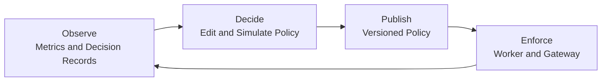
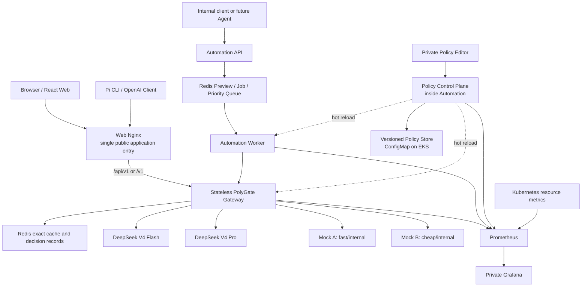

# PolyGate 项目全貌与 30 分钟汇报方向总纲

> 文档日期：2026-07-26  
> 文档性质：项目事实快照、架构总览、当前汇报思想记录、后续 PPT/讲稿/实验设计的共同上下文  
> 目标读者：项目组成员，以及无法直接阅读本仓库、但需要继续完成汇报设计的代理模型或协作者

## 0. 阅读说明与事实口径

这份文档试图在不依赖仓库其他内容的前提下，完整说明 PolyGate 是什么、为什么做、当前实现了什么、系统如何工作、哪些部分尚未完成，以及目前对 30 分钟课程汇报已经形成了哪些初步观点。

本文的事实判断基于 2026-07-26 的工作区源代码、契约、部署清单、测试和文档。需要特别注意：根目录 `README.md` 顶部的部分“当前进度”描述早于后续合并，仍把 Redis 优先队列、Worker 和 Policy 控制面写成待完成；而当前代码中这些能力已经存在。因此本文以当前实现为准，同时明确区分：

- **代码已实现**：仓库中已有实现和相应测试；
- **已有部署清单/脚本**：具备本地或 EKS 部署与验证路径，但不等于阅读本文时云集群一定在线；
- **部分接通**：组件分别存在，但最终用户链路尚未完整连接；
- **规划或后续方向**：不能在最终汇报中当作已完成能力宣传。

本文不把“存在代码”等同于“已经获得最终实验数据”。正式汇报前仍应在确定的 commit、Docker 镜像和 EKS 环境上执行一次完整测试与实验，并保存结果和备用录屏。

---

## 1. 一页式项目摘要

### 1.1 项目是什么

PolyGate 是一个面向团队和多模型 AI 应用的云原生 AI API 网关与策略控制系统。客户端通过统一的 OpenAI-compatible API 或 Web 界面提交请求，不必在业务代码中硬编码具体 Provider。系统根据质量、隐私、预算、延迟、能力和健康状态选择 Provider，并通过缓存、重试、熔断、故障切换和 Kubernetes 弹性扩缩容改善成本、可靠性和容量。

在基础 Gateway 之上，PolyGate 还实现了企业任务 Automation：团队成员把部门、场景、紧急度和偏好表达为结构化 Intent，Automation 将其编译为 Gateway 请求并进入 Redis 优先队列；Worker 决定“哪个任务先执行”，Gateway 再决定“这个任务交给哪个 Provider”。

最后，系统用一套版本化 Policy 同时控制 Gateway 路由和 Automation 调度。管理员可以 Validate、Preview/Simulate、Publish 和 Rollback；Gateway 与 Worker 热加载策略并保留 Last Known Good；Prometheus/Grafana 监控 active version、loaded version 和 policy drift。

因此，PolyGate 不只是“多个 AI API 的中转站”，而可以被理解为：

> **面向团队 AI API 使用的云调度、治理与控制平面。**

### 1.2 项目解决的核心问题

随着团队同时使用多个外部或内部 AI 模型，原本散落在各应用里的问题逐渐变成共享基础设施问题：

1. **团队开发**：不同 API、SDK、鉴权、模型名、Streaming 和 Tool Calling 能力增加集成与迁移成本；每个应用重复实现重试和 fallback。
2. **团队管理**：高峰期有限 AI 资源应该优先服务生产事故还是营销批任务；隐私和部门政策不能依赖开发者自觉遵守。
3. **成本管理**：模型按 token 收费且价格、质量不同；只在月底统计账单太晚，需要请求前预算判断、成本感知路由、缓存和按 Provider 观测。
4. **可靠性管理**：外部 Provider 会超时、限流、返回 5xx 或能力不匹配；调用者不应自行处理全部异常。
5. **策略变更管理**：路由和优先级规则不能永远写死在代码中；改变规则前需要预演，发布后需要版本一致性、可观测性和回滚。

### 1.3 最凝练的项目主张

> **当 AI API 成为团队共享的云资源，Provider 选择与资源分配就不应继续硬编码在每个应用中，而应由统一控制平面治理。**

另一个更适合开场或结尾的表达是：

> **网络应用负责发送 packet，不决定 packet 的每一跳；AI 应用也应表达 intent，而不是决定每个请求具体发给哪个模型。**

---

## 2. 项目定位与典型使用者

### 2.1 PolyGate 不是什么

PolyGate 不是：

- 只把不同 API Key 集中起来的代理；
- 把固定模型映射到固定 endpoint 的简单反向代理；
- 一个以聊天 UI 为主要贡献的 AI 应用；
- 自行训练或托管大模型的推理平台；
- 完整生产级多租户计费、身份和合规平台；
- 已经实现自动强化学习路由的“智能算法”。

它的主要贡献是把异构 AI Provider 当作可治理的云资源，在统一入口后增加策略、调度、可靠性、弹性和可观测能力。

### 2.2 三类主要角色

#### 应用开发者

开发者希望获得一个稳定的 OpenAI-compatible 接口和一个虚拟模型 `auto`，不需要掌握所有 Provider 的差异。开发者只表达质量、隐私、预算、延迟和能力需求；Provider 更换、价格调整或故障处理由平台完成。

#### 团队负责人或平台管理员

管理者希望定义场景模板、任务优先级、隐私护栏和路由政策，并在不修改所有应用代码的情况下改变平台行为。策略变更必须能验证、预演、发布、观察和回滚。

#### 财务与运维人员

他们关注请求量、错误率、P95、Provider 成功率、token、成本、缓存命中、队列等待、HPA 副本数和策略版本一致性。他们需要知道“花了多少钱”以及“为什么做出这个选择”。

### 2.3 四个演示业务场景

Automation 当前围绕四类场景建模：

| 场景 | 默认目标 | 初始场景权重 | 关键政策 |
|---|---|---:|---|
| Production Incident | 高质量、高隐私、低延迟 | 40 | 应优先处理，但隐私默认值可由合法偏好调整 |
| Customer Escalation | 平衡质量与速度 | 25 | 适合演示高质量真实 Provider 路由 |
| Finance Document Summary | 平衡质量、高隐私 | 15 | `privacy=high` 是固定护栏，不允许降级 |
| Marketing Batch Content | 低成本、宽松延迟 | 0 | 适合演示低优先级、低成本批处理 |

紧急度基础分默认为：Critical 100、High 60、Normal 30、Low 10。场景权重和紧急度分数均可通过 Policy 调整，但必须保持 `critical > high > normal > low`。

---

## 3. 核心概念：AI API Control Plane

### 3.1 为什么使用网络控制平面的类比

传统网络系统通过控制平面计算和分发规则，通过数据平面高效转发流量。PolyGate 将类似思想应用到 AI API：

- 应用不直接决定每次请求的物理 Provider；
- 管理者在控制平面定义价格、质量、隐私、预算、能力和优先级规则；
- Gateway 与 Worker 在请求路径上执行已发布策略；
- 遥测和决策记录反馈系统实际行为；
- 管理员根据反馈预演和发布下一版本。

这个类比是汇报的重要理论立足点，但不能简单说“AI 路由等于网络路由”。AI 路由比传统 URL/权重路由多出领域特有变量：

- 按 token 变化的成本；
- 不同模型的质量与 context window；
- Streaming、Tool Calling、parallel tools、content blocks 等能力；
- Prompt 数据离开组织边界的隐私风险；
- 业务场景与紧急度；
- 非确定性输出；
- Provider 限流、模型改名和协议差异；
- 缓存结果与策略版本之间的正确性关系。

因此更准确的表达是：

> Traditional gateways route HTTP traffic; PolyGate routes business intent onto heterogeneous AI resources.

### 3.2 三个逻辑平面

#### 数据/执行平面

处理真实请求和 Prompt，包括 Automation API/Queue/Worker、Gateway、Cache、Provider Adapter 和 Provider。它负责执行策略，不负责让管理员编辑策略。

#### 控制平面

管理 Provider 元数据、路由参数、场景默认值、优先级和队列公平参数；负责校验、模拟、版本化发布、持久化、热加载和回滚。当前主体是 Automation Service 内的 Policy API、Policy Manager、Policy Store 和私有 Policy Editor。

#### 可观测平面

由 Decision Card/Record、Prometheus、Grafana、结构化日志和 Monitoring API 构成。它不是自动决策器，而是控制闭环的反馈信号。

当前 PolyGate 是一个明确的 **human-in-the-loop control loop**：



系统不会在看到指标后自行修改策略。管理员确认、发布前模拟和可回滚是当前版本刻意保留的安全边界。

### 3.3 项目中的两次调度

PolyGate 的独特性可以概括为“同一 Policy 下的两次调度”：

1. **企业任务调度**：Automation Scheduler 决定哪个员工任务先执行；
2. **Provider 路由调度**：Gateway 决定该任务由哪个模型 Provider 执行。

再往下，Kubernetes HPA 负责第三层资源响应：Gateway 负载升高后增加无状态副本。因此可以把系统理解为：

```text
Business priority → AI provider selection → Kubernetes replica scaling
```

---

## 4. 系统总体架构



### 4.1 组件清单

| 组件 | 技术 | 核心职责 | 当前暴露方式 |
|---|---|---|---|
| Web | React + TypeScript | 多轮聊天、Streaming、路由偏好、Decision Card、本地会话 | 通过 Web Service 公开 |
| Web Nginx | nginx-unprivileged | 静态资源、同源 API 代理、Server-side Gateway 身份注入、安全边界 | EKS NodePort 30080 |
| Gateway | FastAPI | OpenAI-compatible API、路由、缓存、可靠性、Decision Record、metrics | ClusterIP，由 Web 代理 |
| Automation API | FastAPI | Intent 模板、Preview、Job API、Policy API、私有 Editor | ClusterIP；本地仅 loopback 8020 |
| Automation Worker | Python worker | 优先领取 Job、调用 Gateway、租约、重试、状态落库、metrics | 无公开业务入口；9000 health/metrics |
| Redis | Redis 7 | Gateway cache、Decision Record、Automation Preview/Job/Queue/Lease | 集群内部 |
| Mock A / Mock B | FastAPI | 可控制价格、延迟、错误和 Streaming 的确定性 Provider | ClusterIP；管理接口仅受控访问 |
| DeepSeek Flash / Pro | 外部 OpenAI-compatible API | 两档真实模型质量与价格 | Gateway 出网访问 |
| Prometheus | Prometheus | 抓取业务、Provider、Policy、Automation 和 Kubernetes 指标 | ClusterIP/port-forward |
| Grafana | Grafana OSS | 业务、成本、队列、资源、HPA 和 Policy Dashboard | ClusterIP/port-forward |
| Monitoring API | FastAPI | 把固定 PromQL 转为稳定 JSON overview | 仅 Compose，本轮不部署 EKS |
| Policy Editor | 静态 HTML/CSS/Alpine CSP | 私有策略编辑、Validate、Preview、Publish、History、Compare、Rollback | Automation 同源私有页面 |
| Pi Extension | TypeScript | 注册 `polygate/auto`、路由偏好、流式 Tool Loop、`/route-last` | Pi 本地扩展 |

### 4.2 本地与云端拓扑

本地使用 Docker Compose，一次启动 Redis、两个 Mock、Gateway、Automation API、Worker、Web、Prometheus、Monitoring API 和 Grafana。Compose 使用独立网络；policy-bootstrap 根据契约示例生成基础 Policy Store。

云端目标是 AWS EKS `us-east-1`。当前清单中：

- Web 2 个副本，通过 NodePort 30080 作为唯一公开应用入口；
- Gateway 基础 2 副本，ClusterIP；
- Gateway HPA 以 CPU 60% 为目标，`minReplicas=2`、`maxReplicas=8`；
- Automation API 1 副本，ClusterIP；
- Worker 1 副本、并发 1，以保证演示队列顺序明确；
- Redis、Mock、Prometheus、Grafana、kube-state-metrics 均不公开；
- Prometheus/Grafana 和 Policy Editor 由管理员通过 `kubectl port-forward` 访问；
- 镜像使用 Git-based immutable tag，并为 EKS x86_64 节点构建 `linux/amd64`。

---

## 5. 三条关键运行链路

### 5.1 直接 Gateway 请求

```text
Web / Pi / OpenAI Client
  → Nginx /v1 proxy
  → Gateway authentication and validation
  → capture one active Policy snapshot
  → exact-cache eligibility and lookup
  → privacy/capability/health/budget/latency/quality routing
  → Provider call with retry/circuit/failover
  → response + Decision Card or SSE
  → Decision Record + Prometheus metrics
```

每个请求在开始时捕获一个 Policy snapshot。后续初始路由和 failover 均使用该快照，避免请求执行中途策略版本变化导致一次请求内出现不一致。

### 5.2 Automation 异步任务

```text
Structured Intent
  → POST /v1/requests/preview
  → normalized intent + priority + Gateway request + code snippets
  → explicit user confirmation
  → POST /v1/jobs with Idempotency-Key
  → Redis priority queue
  → Worker claims by effective priority and fairness rule
  → Worker calls existing Gateway
  → Job completed/failed with Gateway result and decision data
```

Automation 不直接实现 Provider Adapter，也不绕开 Gateway；它只负责编译、排队和调用现有 Gateway。这保持了两层决策的低耦合。

### 5.3 Policy 变更

```text
Admin edits draft
  → Validate fixed schema and guardrails
  → Preview diff + route simulation + priority/queue simulation
  → Publish with base_version
  → durable versioned store
  → active version changes
  → Gateway and Worker poll and validate
  → swap to new in-memory snapshot
  → Grafana observes version convergence or drift
  → Rollback creates a new version when needed
```

---

## 6. Gateway：Provider 数据平面

### 6.1 API 表面

Gateway 主要提供：

| API | 用途 |
|---|---|
| `POST /v1/chat/completions` | OpenAI-compatible 非流式/流式请求 |
| `GET /v1/models` | 暴露虚拟模型 `auto`，同时用于客户端 key 验证 |
| `GET /v1/decisions/{request_id}` | 查询短 TTL 的最终路由记录 |
| `GET /providers` | Provider 价格、隐私、能力和健康摘要 |
| `GET /health` | Gateway 健康与缓存状态 |
| `GET /metrics` | Prometheus 指标 |
| `POST /internal/routing/simulate` | Policy Preview 使用的内部纯路由模拟；不进 OpenAPI，不应由 Web 暴露 |

### 6.2 当前 Provider 注册表

价格是配置中的每 1K token 美元估计，Mock 价格用于演示，不代表真实外部账单。

| Provider | 类型 | 隐私 | 典型延迟 | 质量等级 | 输入/输出价格 | 主要角色 |
|---|---|---|---:|---:|---:|---|
| DeepSeek V4 Flash | real | external | 1500 ms | 1 | 0.00014 / 0.00028 | 较低成本真实模型 |
| DeepSeek V4 Pro | real | external | 2500 ms | 2 | 0.000435 / 0.00087 | 高质量真实模型 |
| Mock A | mock | internal | 300 ms | 0 | 0.0001 / 0.0002 | 快速、隐私友好、故障注入 |
| Mock B | mock | internal | 900 ms | 0 | 0.00005 / 0.00008 | 最低成本、故障注入 |

注册表还声明 context window、max output tokens、Streaming、Tools、parallel tool calls、vision、content blocks、developer role、store 等能力。能力要求是硬门禁，不能为了价格而选择不支持请求协议的 Provider。

### 6.3 路由算法

对于 `model=auto`，路由按以下顺序执行：

1. **Privacy hard guardrail**：`privacy=high` 只保留 internal Provider；
2. **Capability hard gate**：过滤不支持 Streaming、Tools、parallel tools、content blocks、developer role 或 store 等请求能力的 Provider；
3. **Health/circuit filter**：排除不可用或熔断 Provider；
4. **Budget filter**：用粗略输入 token 和 Policy 中的 assumed output tokens 估算调用前成本；hard 模式无满足者即拒绝，soft 模式放宽并选最便宜候选；
5. **Latency filter**：依据 typical latency；hard 模式无满足者即拒绝，soft 模式放宽；
6. **Quality selection**：
   - `cheap`：选择最低估算成本；
   - `high`：默认优先最高 `quality_rank` 的真实 Provider，预算或健康不允许时回落；Policy 也可改为最低成本策略；
   - `balanced`：若真实 Provider 相对最便宜候选的价差在 tolerance 内则选择真实 Provider，否则选择最低成本。

路由返回可读 reason，说明最终 Provider、估算成本、典型延迟，以及是否因隐私、预算或延迟放宽而改变候选集合。

如果客户端显式指定 Provider，Gateway 仍执行未知 Provider、隐私和能力校验，但不会在该 Provider 失败时静默改投其他 Provider，避免违反用户的强制选择。

### 6.4 精确缓存与正确性

Gateway 使用 Redis 做精确/轻规范化缓存，不实现语义缓存。缓存键包含：

```text
normalized messages
+ auto/forced-provider scope
+ privacy
+ quality
+ max_cost
+ latency target
+ policy_version
```

这样能避免不同约束、不同强制 Provider 或不同 Policy 版本错误复用旧结果。Rollback 也会生成新版本号，因此不会重新命中过去版本的缓存。

为了保证语义安全，以下请求绕过缓存：

- Streaming；
- Tools/Tool Calls；
- 消息元数据；
- session id；
- 显式生成参数；
- `cache_control=no-store`；
- 其他未完整进入缓存键的 Agent 请求特征。

发生 failover 的结果不会写入精确缓存，避免一次临时故障永久改变未来请求命中结果。

### 6.5 可靠性机制

Gateway 的可靠性机制包括：

- Provider 单次尝试 timeout；
- 请求总 budget，限制 retry/failover 占用时间；
- 对网络错误、429、部分 5xx 等瞬时错误进行有上限的 retry；
- 指数退避并尊重 `Retry-After`；
- Circuit Breaker 的 closed/open/half-open 状态；
- 对 Mock Provider 的主动健康检查，以及调用结果驱动的熔断状态；
- `model=auto` 下跨 Provider failover；
- Streaming 仅允许在第一个下游事件发送前 failover，绝不把两个 Provider 的流拼接成一个答案；
- 客户端取消不计为 Provider 故障；
- 本地请求校验错误不会误开熔断器；
- 每个请求都有 request ID 和严格分类的 outcome。

### 6.6 Decision Card 与 Decision Record

非流式响应可直接附带 `polygate` Decision Card，包括：

- chosen provider；
- human-readable reason；
- cache hit；
- estimated cost；
- latency；
- input/output tokens；
- retries；
- failover source；
- request ID。

Streaming 为保持标准 OpenAI SSE，不把自定义卡片混入流事件。客户端从响应 Header 读取 `X-PolyGate-Request-ID`、`X-PolyGate-Provider` 和 `X-PolyGate-Policy-Version`，再查询 `GET /v1/decisions/{request_id}`。

Decision Record 默认短 TTL 存于 Redis，并使用严格允许列表：不保存 Prompt、消息、工具参数、Authorization、Provider API Key、上游 endpoint 或原始错误。这既支持 Pi 的 `/route-last`，也减少敏感信息驻留。

---

## 7. Automation：团队任务调度平面

### 7.1 Intent 模型

Automation Intent 包含：

```json
{
  "employee": "Alice",
  "department": "engineering",
  "scenario": "production_incident",
  "urgency": "critical",
  "prompt": "Analyse the production incident log.",
  "preferences": {
    "quality": "high",
    "privacy": "high",
    "max_cost_usd": 0.01,
    "latency_target_ms": 1000
  }
}
```

部门固定为 engineering、support、finance、marketing；场景和紧急度使用受控枚举。Intent 的作用是把业务语义与底层 Gateway 请求解耦。

### 7.2 Preview

`POST /v1/requests/preview` 不调用 Provider、不产生模型费用。它返回：

- normalized intent；
- priority class、initial score 和 reason；
- 编译后的 Gateway request；
- 可复制的 JSON、curl 和 Python snippets；
- Policy 对用户偏好的调整；
- captured policy version；
- 短 TTL preview ID。

用户必须看到 Preview 并显式确认后才能提交 Job。修改需求后应重新 Preview。

### 7.3 Job API 与状态

提交使用：

```http
POST /v1/jobs
Idempotency-Key: <client-generated key>
```

Body 必须包含当前 `preview_id` 和 `confirmed=true`。状态机为：

```text
queued → running → completed
                  ↘ failed
```

Job 保留 priority、queue position、created/started/completed time、result/error 和 policy version。公开 JobRecord 不包含执行 Prompt；完整 Gateway payload 单独存于 Worker 专用 Redis key，任务完成或最终失败后主动清理。

同一个 Idempotency-Key 在 24 小时内收敛到同一个 Job，避免浏览器双击、Agent retry 或网络重发造成重复费用。

### 7.4 优先级与公平性算法

初始优先级：

```text
initial_score = urgency_score + scenario_weight
```

运行时有效优先级：

```text
effective_priority = initial_score + waiting_bonus
```

默认 waiting bonus 每等待 5 秒增加 1 分，最多增加 30 分。同分任务按创建时间 FIFO。

防饥饿规则默认是：连续执行 3 个 Critical/High 后，如果有 Normal/Low 已等待至少 20 秒，则强制选择等待最久的低档任务；执行后高优先 streak 清零。所有数值由 Policy 控制，可热更新。

课程演示脚本刻意按 Low → Normal → High → Critical 的反向顺序提交，只有 Critical 实际最先被领取，才能证明调度不是 FIFO 或提交时机巧合。

### 7.5 Worker 可靠性

Worker 当前固定并发 1。它：

- 每秒形成一次领取窗口；
- 从 Redis pending set 中计算候选优先级；
- 通过领取权检查避免同一 Job 被重复执行；
- 为 Running Job 设置和续租 lease；
- Worker 中断后扫描过期 lease 并重新入队；
- 对 408、429、5xx 和网络错误进行有上限重试；
- 对 400、401、403、422 等永久错误直接失败；
- 使用独立 Gateway client key，不记录该 key；
- 将 Gateway 完整结果写入 Job；
- 暴露 queue depth、in-flight、wait time、job duration、processed、retried、failed 和 policy metrics。

重新入队不会重置 `created_at`，因此 waiting bonus 会继续累计，避免故障恢复后的任务丢失已等待的优先级。

---

## 8. Policy Control Plane

### 8.1 可编辑 Policy 范围

Policy v1 同时包含 Gateway 和 Automation 参数。

Gateway 可编辑项：

- assumed output tokens；
- balanced real-provider price tolerance；
- budget mode：soft/hard；
- latency mode：soft/hard；
- high-quality strategy：prefer real/lowest cost。

Automation 可编辑项：

- 四档 urgency score；
- 四个场景的 weight；
- 场景默认 quality/privacy/max cost/latency；
- waiting bonus interval、points、cap；
- starvation streak threshold 和 wait seconds。

### 8.2 不允许管理员关闭的固定护栏

以下属于服务器固定 guardrails，不出现在可编辑 Policy 中：

- `privacy=high` 只能路由到 internal Provider；
- Finance Summary 的默认 privacy 必须为 high；
- Provider capability 必须匹配请求；
- 未知 Provider 必须拒绝；
- Policy Admin API 必须鉴权；
- urgency 分数必须严格递减；
- schema 之外的未知字段必须拒绝。

这种设计区分了“可调政策”和“安全不变量”：管理员可以优化成本和调度，但不能通过配置关闭基本隐私和协议安全。

### 8.3 生命周期

Policy API 支持：

- 获取 active policy；
- 查看最多 20 个版本的历史；
- Validate；
- Preview；
- Publish；
- Rollback 到历史版本内容，但创建新的递增版本号。

Publish 要求携带 `base_version`。如果管理员基于旧版本编辑，而 active version 已改变，则返回 409，避免 lost update。EKS Policy Store 使用 Kubernetes ConfigMap 和 resourceVersion 实现 compare-and-swap 风格的并发控制。

### 8.4 Preview 与模拟

Policy Preview 不写存储，也不调用真实 Provider。它提供：

- 字段级 before/after diff；
- warnings；
- 多个 Gateway routing cases 的 Provider/reason/cost/latency before/after；
- 多个 Intent 的 priority score before/after；
- queue order before/after。

Automation 通过 Gateway 私有 `/internal/routing/simulate` 调用真实路由函数，因此 Preview 与运行时路由共享实现，不维护一套容易漂移的“假算法”。该内部 API 不触碰缓存和 Provider。

### 8.5 发布、热加载与 Last Known Good

Policy API 发布持久版本后，Gateway 和 Worker 定期拉取 active policy，并利用 ETag/If-None-Match 避免不必要传输。新 Policy 只有在完整解析和校验成功后才原子替换内存快照。

网络错误、HTTP 错误、损坏文件或校验失败时，组件保留 Last Known Good，并增加按 reason 分类的 reload failure 指标。启动时可从挂载文件获得基础策略；随后由 Policy API 更新。

Policy 一致性不是强同步事务，而是数秒内的最终一致性。Grafana 的 Policy Version Drift 使用 `max(active) - min(loaded)`；0 表示组件收敛，非 0 持续超过 30 秒意味着某个组件可能停留在旧版本。

### 8.6 本地与 EKS 持久化差异

- Compose 中 Automation 允许开发用环境变量 admin key，并使用内存 Policy Repository。发布和回滚能改变运行中的 active policy，但 Automation 容器重启后回到挂载基线；这适合本地语义和热加载测试，不代表持久化。
- EKS 中 Policy Store 位于 ConfigMap，Automation 使用专用 ServiceAccount；Role 只能 `get/update` 指定 `polygate-routing-policy` ConfigMap，不能 list 全部 ConfigMap 或读取 Secrets。版本历史与 active policy 随 ConfigMap 持久存在。

### 8.7 私有 Policy Editor

Policy Editor 与 Automation API 同源，由同一镜像提供，不经过公开 Web Nginx。其特点包括：

- 严格 CSP、`Cache-Control: no-store`；
- Alpine CSP 依赖本地 vendored、固定版本和 checksum，不依赖 CDN；
- 无 Node 构建链和浏览器持久化草稿；
- Admin key 由管理员手动输入，仅保留在页面内存闭包；刷新、断开或 401 后清除；
- 编辑后必须重新 Validate 和 Preview，才能 Publish；
- 支持版本历史、比较和 Rollback。

---

## 9. Web、Pi 与客户端体验

### 9.1 React Web

当前 Web 是直接 Gateway 客户端，具备：

- 多轮聊天；
- 本地会话列表和 localStorage 持久化；
- Markdown 渲染；
- Streaming SSE；
- quality、privacy、maximum cost 和 latency routing preferences；
- Gateway online 状态；
- Provider、reason、cost、latency、tokens、retries、failover 和 request ID 展示；
- 同源 `/api/v1` 调用，浏览器不持有 Gateway credential。

Web Nginx 用 allowlist 只代理 `/api/v1/`，并覆盖客户端 Authorization，注入专用 Web identity。其他 `/api/` 路径返回 404，因此 `/metrics`、`/docs`、`/openapi.json` 和 `/internal/routing/simulate` 不会因为 Nginx 代理而意外公开。

### 9.2 Pi Extension

Pi 扩展当前实现的是 **Gateway Provider 集成**，不是完整 Automation Agent。它：

- 注册 `polygate/auto`；
- 通过 `/login polygate` 保存 Gateway URL 和 client key；
- 用 5 秒预算验证 `/v1/models`，不产生模型调用；
- 提供 `/route` TUI 配置 quality/privacy/cost/latency；
- 只在使用 PolyGate Provider 时注入约束；
- 支持 OpenAI Streaming、Tool Calling 和工具循环；
- 从响应 Header 获取 request ID；
- `/route-last` 查询最终 Provider、成本、tokens、retry、failover、outcome 和 request ID；
- 决策数据仅在本地展示，不放回模型 Prompt。

### 9.3 尚未完整接通的 Agent/Automation 用户链路

仓库 `agent/README.md` 定义了未来 Agent 应提供的三个工具：

- `preview_polygate_request`；
- `submit_polygate_job`；
- `get_polygate_job`。

也定义了未来 Web Agent SSE 事件。但当前主要可运行 Pi Extension 是直接调用 Gateway 的路由插件，React Web 也主要直连 Gateway；“Web 需求卡片 → Agent → Automation Preview → 用户确认 → 排队 → Gateway”的统一端到端产品流程不能按完整成品宣传。

Automation API、Redis Queue、Worker 和契约本身已经实现，可用脚本/API 进行完整后端演示。最终汇报可以：

1. 把 Automation 作为内部团队调度控制面，通过演示脚本/API 展示；或
2. 在汇报前完成最薄的 UI/Agent 接线后再宣传统一用户流程。

---

## 10. 可观测性与证据链

### 10.1 Gateway 指标

Gateway 指标覆盖：

- request outcome 与 end-to-end duration；
- cache hit/miss/bypass；
- Provider request outcome 与 latency；
- input/output tokens；
- estimated cost by Provider；
- circuit state；
- retries 和 reason；
- failover from/to；
- streaming outcome；
- request budget exhaustion；
- loaded policy version 与 reload failure。

所有 label 保持低基数。Prompt、employee、job ID、request ID、URL 和原始错误不进入 Prometheus label。

### 10.2 Automation 与 Policy 指标

Worker 指标包括：

- jobs processed/failed/retried；
- job execution duration；
- queue depth；
- in-flight；
- queue wait duration；
- Worker loaded policy version；
- policy reload failures。

Policy API 指标包括：

- active policy version；
- publish/rollback 的 success/rejected/degraded；
- last successful publish timestamp。

### 10.3 Grafana Dashboard

当前 Dashboard 约 40 个面板，覆盖：

- Gateway availability、total requests、request rate；
- service error、client rejection、cancellation；
- P95 latency；
- cache hit；
- tokens 与 estimated cost；
- Provider request rate、success、P95 和 cost；
- Gateway CPU、memory、per-Pod resources、restarts；
- available/desired replicas 和 HPA history；
- Automation queue depth、in-flight、job outcomes、wait P95、execution P95；
- active policy、Gateway loaded policy、Worker loaded policy、policy drift；
- publication outcome、last publication 和 reload failures；
- 私有 Policy Editor 管理入口。

### 10.4 Alerts 与 Monitoring API

Prometheus recording rules/alerts 包括：

- Gateway target down；
- Provider error/timeout rate high；
- Gateway P95 above SLO；
- circuit open too long；
- Gateway Pod restarting；
- HPA at max replicas。

Client rejection 和 cancellation 被单独统计，不混入 service error，避免把用户输入错误误判为服务故障。

Monitoring API 只允许 `5m`、`15m`、`1h`、`6h` 固定窗口，把受控 PromQL 转为稳定 JSON；它是本地可选消费者，不部署到 EKS。Grafana 在云端直接读取 Prometheus。

---

## 11. Kubernetes、云计算与安全设计

### 11.1 云原生设计点

- Gateway 无状态化，Provider registry 和 Policy 以配置挂载/热加载，缓存放 Redis；
- Gateway Deployment 有 requests/limits、readiness/liveness、两个基础副本；
- HPA 基于 CPU 60% 从 2 扩到最多 8；
- Mock Provider 提供可重复的延迟和故障实验，不依赖昂贵真实调用；
- Prometheus 使用多 Pod service discovery，Grafana 同时显示业务与 Kubernetes 指标；
- Automation API 与 Worker 分进程，API 可横向扩展，Worker 暂时单副本保持确定性；
- 版本化策略是控制面，Gateway/Worker 是最终一致的数据面消费者；
- 契约和镜像版本进入 Git，Dashboard/Prometheus 配置以代码管理。

### 11.2 公开面与内部面

当前公开用户入口是 Web NodePort，而不是 LoadBalancer。Gateway、Automation、Worker、Redis、Mock、Prometheus、Grafana 和 Policy Editor 均保持内部访问。Web 同时支持：

- `/api/v1/`：浏览器调用，由 Nginx 注入 server-side Web key；
- `/v1/`：Pi/CLI 等 OpenAI client 传递自己的 Bearer key。

这既维持单一应用入口，也避免把 Automation Admin、Prometheus 或 Provider 管理接口暴露到公网。

### 11.3 容器和 Secret 安全

主要 Deployment 使用：

- `runAsNonRoot`；
- `allowPrivilegeEscalation=false`；
- drop all Linux capabilities；
- `readOnlyRootFilesystem`；
- RuntimeDefault seccomp；
- 最小 resources 与探针；
- DeepSeek key、Gateway client keys、Policy admin key、Grafana credentials 通过 Kubernetes Secret；
- Web key 由 Nginx 运行时读取，不打进静态 JavaScript；
- Worker 不自动挂载 ServiceAccount token；
- Policy Controller 只获准操作单个命名 ConfigMap。

### 11.4 Learner Lab 取舍

当前 AWS Learner Lab 的 EBS CSI/Pod Identity 权限不足，Redis 改用 `emptyDir`；Prometheus/Grafana 在 EKS 中也使用临时存储，Prometheus 保留最多两天数据。这个选择适合课程项目的缓存、短期 Job 和演示指标，但不是生产级持久化方案。

因此最终汇报应明确：

- Redis Pod 重建会丢失 cache、Decision Record 和 Automation 临时状态；
- Prometheus/Grafana Pod 重建会丢失云端历史；
- Policy Store 使用 ConfigMap 持久化，不依赖 Redis，因此策略版本可独立保留；
- Production 版本应使用托管 Redis/持久卷、持久化监控后端和更完整的身份系统。

---

## 12. 契约、测试与工程协作

### 12.1 Contract-first 边界

`contracts/` 是四人协作的冻结区，定义：

- Gateway request；
- Decision Card/Record；
- Provider registry；
- Monitoring overview；
- Automation Intent/Preview/Job；
- Policy Draft/Store/examples。

其作用不仅是生成数据结构，更是隔离 Gateway、Provider、Automation、Web、Pi、Monitoring 和部署工作，减少四人并行时的隐式破坏。

### 12.2 测试覆盖的关键不变量

Gateway 测试重点包括：

- 不同约束和 Policy version 的缓存隔离；
- quality/price/privacy/budget/latency 路由；
- Tools、Streaming 和 Pi compatibility；
- retry、Retry-After、request budget、timeout、failover；
- Streaming 不拼接 Provider；
- cancellation 与 Provider error 分离；
- Decision Record 的 TTL、允许列表和最终 usage；
- Policy simulation 不调用 Provider/Cache；
- Last Known Good 和热加载。

Automation 测试重点包括：

- Intent、模板、Finance privacy lock；
- Preview 和 snippets；
- Idempotency；
- effective priority、waiting bonus 和 starvation guard；
- Worker retry、lease 和状态迁移；
- Policy schema、并发冲突、版本历史和 rollback；
- ConfigMap compare-and-swap 和 repository reconciliation；
- Policy Admin 鉴权、错误脱敏和 UI 安全头；
- Policy Preview 的路由/优先级模拟一致性。

Web、Monitoring、部署与契约还有 Vitest/Playwright、Python、Shell smoke/preflight tests。正式汇报前的验证重点不应只看 `0 failed`：Gateway 测试需要真实 Redis，避免缓存用例静默 skip；Web 需要 Node 22，避免 Node 25 实验性 localStorage 干扰 jsdom。

### 12.3 建议的最终发布闸门

1. 固定 commit 和不可变 image tag；
2. 后端、Web、契约和 deployment tests 全绿；
3. Compose 完整栈健康；
4. Web、Automation、Policy、Prometheus、Grafana smoke tests 全绿；
5. EKS probes、HPA、targets、Secrets 和 RBAC 验证；
6. 运行真实 DeepSeek 小额路由 gate；
7. 执行最终演示脚本并保存终端输出、Grafana 时间线和录屏；
8. 检查所有日志不含 admin key、Provider key 或真实敏感 Prompt。

---

## 13. 当前实现状态与边界

### 13.1 可以作为已实现能力展示

- OpenAI-compatible Chat Completions 和虚拟 `auto` model；
- Web 多轮聊天、Streaming、路由偏好和 Decision Card；
- DeepSeek Flash/Pro 与两个可控 Mock Provider；
- 质量、隐私、预算、延迟、能力和健康感知路由；
- 精确缓存与 Policy version 隔离；
- Retry、Circuit Breaker、request budget、failover；
- Streaming Tool Loop compatibility 和 Decision Record；
- Redis Automation Preview/Job/Priority Queue；
- waiting bonus、FIFO tie break、starvation guard；
- Worker lease、重试、恢复和 Gateway 调用；
- 版本化 Policy、Validate/Preview/Publish/Rollback；
- Gateway/Worker 热加载、Last Known Good、Policy Drift；
- 私有 Policy Editor；
- Prometheus/Grafana 业务、成本、队列、资源、HPA 和策略监控；
- Docker Compose 与 EKS 清单、脚本、探针、limits、Secrets 和最小 RBAC；
- Pi `polygate/auto`、路由 TUI、Streaming tools 和 `/route-last`。

### 13.2 部分完成或需要谨慎表述

- Web、Pi、Automation 各自可运行，但统一的“需求卡片→Agent→Preview→Confirm→Job”前端链路尚未完整接通；
- 单一公开入口已经由 Web NodePort 实现，但不是原 proposal 中计划的 LoadBalancer；
- HPA 是 CPU 驱动，不是 request-based/KEDA queue scaling；
- 主动健康检查主要面向可控 Mock，真实 Provider 可靠性更多依赖调用结果、retry 和 breaker；
- 监控面板和脚本存在，但最终汇报需要重新采集有说服力的负载和故障实验数据；
- Compose Policy 发布使用内存 Repository，只有 EKS ConfigMap 路径能证明跨 Automation 重启持久化。

### 13.3 明确未实现或不应宣称

- 语义缓存；
- KEDA 或 scale-to-zero；
- 自动根据监控调整 Policy 的闭环控制；
- Provider CRD 或 Kubernetes Gateway API Inference Extension；
- 完整 Agent Service 与 Web Agent SSE；
- 多云集群部署；当前是单 EKS + 多 Provider；
- 生产级员工身份、RBAC、多租户计费、每日预算扣账和完整审计平台；
- 持久化 Redis Job Queue 和长期 Prometheus 存储；
- 复杂机器学习/强化学习路由；当前是透明规则和策略控制。

---

## 14. 项目的主要亮点与云计算价值

### 14.1 不是功能堆叠，而是一条完整控制链

项目最强之处不是单个算法，而是把以下环节接成闭环：

```text
Intent → Policy → Priority Scheduling → Provider Routing
→ Reliability/Scaling → Decision Record/Metrics
→ Policy Simulation/Publish/Rollback
```

### 14.2 控制平面与数据平面的分离

应用调用协议与 Policy 生命周期分离；Policy Editor/API 不处理 Prompt，Gateway/Worker 不负责管理员编辑。这种架构使策略可以独立版本化、部署、观察和回滚，是课程中值得重点讲的系统设计。

### 14.3 两层调度

Automation 回答“谁先算”，Gateway 回答“去哪里算”。这比普通 AI relay 或只按 Provider 权重负载均衡更能体现共享云资源管理。

### 14.4 FinOps 进入请求路径

成本不只是事后 Dashboard，而是请求前 Provider 过滤和选择的一等约束；缓存、预算和不同质量档共同改变执行行为。

### 14.5 单请求与系统级双重可解释性

Decision Card/Record 解释单个请求，Prometheus/Grafana 解释整体系统。管理员既能回答“为什么这个请求去了 Pro”，也能回答“过去 15 分钟哪个 Provider 成本和错误最高”。

### 14.6 可重复实验

真实 Provider 证明兼容真实 API；Mock Provider 控制延迟、错误和价格，使缓存、熔断、failover、HPA 和监控实验可重复、低成本。这比完全依赖外部模型状态更适合课程展示。

### 14.7 对约束和失败的诚实处理

项目显式处理 Learner Lab IAM、存储和网络限制，区分演示环境与生产方案；在 Streaming failover、cache correctness、Policy eventual consistency 和 Secret 边界上有明确不变量，而不是只展示 happy path。

---

## 15. 用户目前对 30 分钟汇报的初步方向

本节记录用户目前已经明确提出的汇报思想，避免后续代理只看到建议而忽略原始意图。

### 15.1 汇报必须有一个立足点

用户首先提出：这是一门 **Cloud Computing** 课程的 30 分钟项目展示，不能只是把所有实现过一遍。整场汇报需要一个“power point”或中心立足点，让观众听完后能够带走一个有普适价值的认识。

因此，PPT 不应按成员或目录依次介绍 Gateway、Redis、Web、Kubernetes、Grafana；这些技术必须被同一个问题和同一条故事线连接。

### 15.2 用户提出的两个关键故事

#### 故事一：实际需求与使用场景

用户希望从团队真实使用 AI API 的需求出发，至少覆盖：

1. **团队管理**：不同员工、部门和业务场景如何获得优先级；隐私和组织政策如何被统一执行；
2. **团队开发**：开发者如何用统一接口接入多个 Provider，避免重复集成和硬编码；
3. **成本管理**：如何在请求前控制预算、选择不同价格/质量模型，并在请求后观察 token 和成本。

这部分回答“为什么需要 PolyGate”，强调项目不是为单个用户做一个漂亮 Chatbox，而是为团队共享 AI 能力提供基础设施。

#### 故事二：AI API 控制平面

用户注意到传统网络路由具有优雅的数据平面/控制平面分层，而多 AI API 管理同样涉及网关、路由和策略，因此希望把项目解释为一个 **for AI APIs 的 Control Plane**。

该控制平面负责：

- 监控系统与 Provider；
- 引导开发者和任务表达需求；
- 更改路由、优先级和成本配置；
- 将规则发布给实际执行请求的 Gateway 和 Worker。

这部分回答“PolyGate 在架构上是什么”，并被用户视为可能的核心立足点。

### 15.3 两个故事之间的关系

目前最自然的合并方式是：

- **故事一是 Why**：团队开发、管理、成本问题说明为什么单个 API relay 不够；
- **故事二是 How/What**：控制平面把散落在业务代码中的 Provider 决策提升为共享平台能力。

整场汇报的因果链应是：

```text
AI APIs become shared team resources
→ application-level integration no longer scales
→ routing decisions must move out of applications
→ build an AI API control plane
→ data plane executes policy
→ observability closes the human control loop
```

### 15.4 当前建议的核心表达

以下表达是对用户两个故事的综合，可在后续 PPT 设计中选择：

> **当 AI API 成为团队共享的云资源，Provider 选择就不应该继续硬编码在应用中，而应该由一个控制平面统一治理。**

> **PolyGate 把一次黑盒式 AI API 调用，变成可调度、可治理、可观测、可回滚的云工作负载。**

> **One endpoint for developers. One policy plane for the organization.**

> **Developers express intent. The control plane decides. The data plane executes. Observability proves what happened.**

> **我们没有再做一个聊天机器人；我们做的是 AI 工作负载的云调度与治理层。**

其中第一句最贴近用户最新提出的控制平面方向；“managed cloud workload”可以作为解释项目全部云原生能力的辅助概念。

---

## 16. 建议的 30 分钟叙事结构

这是在用户当前两个故事基础上的初步结构，不是最终讲稿。

| 时间 | 章节 | 目标 |
|---:|---|---|
| 0–3 分钟 | Monday 9 AM 的团队高峰场景 | 用生产事故、财务摘要、客户升级、营销批任务提出“谁先算、去哪算、失败怎么办、谁解释” |
| 3–7 分钟 | 三类真实需求 | 团队开发、团队管理、成本管理；说明多个 Provider 已成为共享基础设施问题 |
| 7–10 分钟 | 核心洞察 | 从网络 control/data plane 类比推导 AI API Control Plane |
| 10–13 分钟 | 总体架构 | 明确控制面、执行面、可观测面和边界 |
| 13–16 分钟 | 第一次调度 | Automation 决定哪个业务任务先执行，解释优先级、公平性和幂等性 |
| 16–19 分钟 | 第二次调度 | Gateway 根据质量、隐私、成本、延迟、能力和健康选择 Provider |
| 19–26 分钟 | 连贯现场演示 | 反向提交、Decision Card、策略 Preview/Publish/收敛/Rollback、Grafana 证据 |
| 26–28 分钟 | 实验结果 | 调度、路由、failover、cache、HPA、policy convergence 的量化结果 |
| 28–29 分钟 | 工程取舍 | Learner Lab、临时存储、CPU HPA、未完成 Agent 链路等边界 |
| 29–30 分钟 | Takeaway | 回到“共享 AI 资源需要控制平面” |

如果 30 分钟包含问答，应把正式内容压缩到约 24–25 分钟，保留 5–6 分钟问答。不要牺牲核心演示来塞入所有模块细节。

---

## 17. PPT 初步结构

建议最终控制在 12–14 页；现有 15 页 proposal deck 可复用视觉风格，但内容应从“计划做什么”重写为“系统如何工作、我们证明了什么”。

1. **Title**：PolyGate — An AI API Control Plane for Teams
2. **Cold Open**：Monday 9 AM，四个团队任务和多个不稳定 Provider
3. **Three Team Problems**：开发、管理、成本
4. **Why a Relay Is Not Enough**：普通 API relay 与 PolyGate 的差异
5. **Core Insight**：应用只表达 intent，Provider 决策进入控制平面
6. **Architecture**：control plane、execution plane、observability plane
7. **Scheduling Stage 1**：谁先执行
8. **Scheduling Stage 2**：哪个 Provider 执行
9. **Policy Lifecycle**：Validate、Simulate、Publish、Converge、Rollback
10. **Reliability and Elasticity**：cache、retry、circuit、failover、HPA
11. **Demo Hypotheses**：现场将证明哪些行为
12. **Experimental Evidence**：数字和 Grafana 时间线
13. **Trade-offs and Boundaries**：课程环境与生产设计差距
14. **Takeaway**：共享 AI 基础设施需要控制平面

不建议单独制作“技术栈 Logo 墙”。FastAPI、Redis、Kubernetes、Prometheus 和 Grafana 是支撑架构主张的工具，不是项目本身的结论。

---

## 18. 建议的演示故事

### 18.1 一个统一场景

演示可以从以下情景开始：

> 周一上午九点，Marketing batch 最早进入队列，随后 Finance summary、Customer escalation 和 Production incident 到来。最强模型正在限流，财务数据不能出网，预算也有限。系统应该先处理谁、交给谁、失败后怎么办，管理员如何确认系统遵守了政策？

### 18.2 演示步骤

#### 第一步：证明任务调度不是 FIFO

按 Low → Normal → High → Critical 反向提交四个任务。展示提交顺序、initial score、policy version 和 `started_at`。Critical 应最先被领取，同时全部任务最终完成。

#### 第二步：证明不同 Intent 导致不同 Provider 决策

用 Decision Card 或 Decision Record 展示：

- high quality + standard privacy 倾向高质量真实 Provider；
- 收紧预算后选择较便宜 Provider；
- high privacy 排除所有 external Provider；
- reason 明确解释过滤和选择过程。

#### 第三步：证明故障不会简单击穿调用者

对可控 Mock 注入 timeout/5xx，展示 retry、circuit/failover 和最终结果，同时观察 Provider errors、retries、failovers 和 latency 指标。Streaming 演示必须说明只在首个下游 chunk 前 failover。

#### 第四步：把控制平面推到演示高潮

1. 客户端保持同一个 `model=auto` 请求不变；
2. 管理员修改一个已验证能改变路由或优先级的 Policy 参数；
3. Preview 显示 provider/score/queue before/after；
4. Publish vN+1；
5. Grafana 显示 active、Gateway loaded、Worker loaded 收敛且 drift=0；
6. 再发同一请求，Decision Record 显示可预测的行为变化；
7. Rollback 创建 vN+2，并再次收敛。

这一步是“控制平面存在”的最强证据：不是页面存在，而是 **应用代码不变，发布 Policy 后数据平面行为以可预测、可观测、可回滚的方式改变**。

#### 第五步：用 Grafana 收束

不要把 Grafana 当作一张静态漂亮截图。让它回答刚才发生的事情：

- 队列顺序和等待时间；
- 哪个 Provider 被调用；
- 是否 retry/failover；
- token 和成本；
- HPA/Pod 变化；
- 当前 Policy 是否收敛。

### 18.3 HPA 演示策略

HPA 从零开始等待可能耗时且受 Learner Lab 波动影响。建议在演示前启动可控负载，使正式展示时 Grafana 已经形成 2→N→2 的副本时间线；现场再用 `kubectl get hpa` 证明当前状态。另备录屏和截图，不把整场成功寄托在等待 HPA 触发上。

---

## 19. 正式汇报前需要补齐的量化证据

| 要证明的主张 | 实验方法 | 应保存的证据 |
|---|---|---|
| 队列按政策而非 FIFO | 反向提交四个任务 | 提交顺序、实际 `started_at`、wait time、policy version |
| 路由真正受约束影响 | 控制 quality/privacy/budget/latency | chosen provider、reason、cost、latency |
| Privacy 是硬护栏 | high privacy + 强制 external/auto | 403 或 internal provider，且 Policy 无法关闭护栏 |
| 缓存减少重复调用 | 两次相同、可缓存、非流式请求 | 第二次 cache hit、Provider call 增量、latency、cost |
| 故障能够恢复 | Mock 注入 500/timeout/429 | retry/failover/circuit 指标、最终 outcome 和额外延迟 |
| Streaming 不拼接 | 首 chunk 前后分别制造故障 | failover 或 partial error 的边界证据 |
| Gateway 能弹性扩展 | 固定并发/CPU 压测 | replicas 2→N、CPU、request rate、P95 时间线 |
| Policy 能安全改变行为 | Preview→Publish→Rollback | diff、模拟结果、版本号、loaded version、drift=0 |
| Policy 故障不破坏数据面 | 中断 API 或提供非法版本 | Last Known Good、reload failure、请求继续服务 |
| 安全边界有效 | 测 Web/Automation/internal routes 和 RBAC | 公开路径、401/404、`kubectl auth can-i` 结果 |

最终 Results 页应包含真实数字，而不是只写“supports autoscaling/failover”。如果时间有限，优先获得调度、Policy 发布收敛、Provider failover 和 HPA 四组结果。

---

## 20. 汇报时应避免的误导性表述

1. 不说“我们做了多云系统”；准确说法是“单 EKS 部署下的多 Provider AI access”。
2. 不说“完整 Agent 自动化用户链路已经上线”，除非汇报前完成 Web/Agent 接线。
3. 不说“LoadBalancer 单一入口”；当前实现是 Web NodePort 单一入口。
4. 不说“HPA 根据请求量扩容”；当前是 CPU utilization。
5. 不说“Redis 是生产级持久队列”；当前 EKS 使用 `emptyDir`。
6. 不说“监控自动修改路由策略”；当前是 human-in-the-loop。
7. 不说“所有 Provider 都有主动健康探测”；真实 Provider 更多依赖调用反馈和 breaker。
8. 不说“已实现每日成本扣账、完整限速和企业身份系统”。
9. 不说“使用了 AI/ML 智能路由算法”；当前优势是透明、可解释的 policy-based routing。
10. 不把测试数量、代码量或技术栈数量当作项目主要价值。

坦诚这些边界并不会削弱项目，反而说明团队理解课程原型与生产平台的差距。

---

## 21. 可供开场、转场和收尾使用的句子

### 开场问题

> 当 Marketing batch、Finance summary 和 Production incident 同时争用有限 AI 资源时，谁先运行？该去哪个模型？Provider 失败怎么办？谁能解释这个决策？

### 从需求转向架构

> 这不是三个应用功能问题，而是共享 AI 基础设施缺少控制平面的问题。

### 控制平面类比

> 网络应用不会选择 packet 的每一跳；同样，业务应用也不应硬编码每个 AI 请求的 Provider。

### 四段式主张

> Developers express intent. The control plane decides. The data plane executes. Observability proves what happened.

### 项目定位

> One endpoint for developers. One policy plane for the organization.

### 最终 takeaway

> **AI API 正在从开发者手中的第三方 SDK，变成团队共享的云基础设施；而共享基础设施需要一个控制平面。**

或：

> **云计算的价值不只是把服务部署到云上，而是把谁先运行、在哪里运行、失败后怎么办、策略如何安全改变，变成平台能力。**

---

## 22. 后续工作清单

### 汇报设计

- 在组内确认最终主标题是否采用 “An AI API Control Plane for Teams”；
- 决定“control plane”与“managed cloud workload”谁做标题、谁做辅助解释；
- 确认 30 分钟是否包含 Q&A；
- 按统一故事分配讲述责任，不按代码目录或成员机械切分；
- 重写 proposal deck，避免继续出现已过时的计划状态。

### 产品与演示

- 决定是否补最薄的 Web/Agent→Automation 接线；
- 固定一组可预测的 Policy before/after 场景；
- 固定故障注入参数，避免现场随机性；
- 预热 HPA 负载并保存 Grafana 时间线；
- 准备 API/terminal、Web、Policy Editor、Grafana 四个窗口的切换顺序；
- 为每个现场步骤准备截图和短录屏兜底；
- 避免在投影或日志中显示任何 Secret。

### 实验与证据

- 在同一镜像版本上执行完整集成闸门；
- 采集第 19 节的关键数据；
- 生成一张简洁 Results 表；
- 保存 `kubectl get hpa/deploy/pods`、Automation 调度顺序和 Policy convergence 输出；
- 记录真实 DeepSeek 调用成本，避免只展示 Mock 数据。

---

## 23. 关键术语速查

| 术语 | 本项目中的含义 |
|---|---|
| Intent | 员工、部门、场景、紧急度、Prompt 和 AI 偏好的结构化业务需求 |
| Preview | 不产生 Provider 调用的编译与决策预览 |
| Job | 用户确认后进入 Redis Queue 的异步任务 |
| Policy | 同时控制 Gateway 路由和 Automation 调度的版本化配置 |
| Guardrail | 管理员不能关闭的服务器固定安全不变量 |
| Data/Execution Plane | Worker、Gateway、Cache、Provider 等真实执行请求的路径 |
| Control Plane | Policy 验证、模拟、版本化发布、存储、分发和回滚系统 |
| Observability Plane | Decision Record、metrics、logs、Prometheus 和 Grafana |
| Decision Card | 随非流式回答展示的单请求路由解释 |
| Decision Record | Streaming/Agent 可按 request ID 查询的短 TTL 最终决策记录 |
| Last Known Good | 新 Policy 获取或校验失败时继续使用的最近合法版本 |
| Policy Drift | 控制面 active version 与 Gateway/Worker loaded version 的差值 |
| Effective Priority | initial score 加 waiting bonus 后的实时任务优先级 |
| Failover | `model=auto` 请求在下游输出开始前从失败 Provider 切换到另一 Provider |

---

## 24. 仓库事实来源索引

本文已经自包含；以下文件用于后续核对实现细节：

- 项目入口与集成闸门：`README.md`
- Gateway：`gateway/README.md`、`gateway/app/`
- Provider 注册表：`contracts/providers.yaml`
- Automation：`automation/README.md`、`automation/app/`
- Policy 设计：`docs/superpowers/specs/2026-07-24-policy-management-design.md`
- Agent 边界：`agent/README.md`
- Pi Extension：`.pi/extensions/polygate-routing/README.md`
- Web：`web/README.md`、`web/src/`
- 冻结契约：`contracts/README.md`、`contracts/*.schema.json`
- Compose：`docker-compose.yml`
- Kubernetes：`deploy/*.yaml`、`deploy/README.md`、`deploy/RUNBOOK.md`
- Monitoring：`monitoring/README.md`、`deploy/monitoring/README.md`
- Grafana Dashboard：`monitoring/grafana/dashboards/polygate-overview.json`
- 演示/测试脚本：`scripts/automation-peak-test.sh`、`scripts/kubernetes-policy-smoke-test.sh`、`scripts/deepseek-v4-routing-smoke-test.sh`、`scripts/kubernetes-monitoring-smoke-test.sh`

---

## 25. 最终总结

PolyGate 的完整价值不在于“用了很多云组件”，而在于形成了一个可以清楚解释的系统：团队成员表达业务 Intent；Automation 根据组织优先级决定谁先运行；Gateway 根据质量、隐私、预算、延迟、能力和健康状态决定在哪里运行；Redis、retry、circuit breaker、failover 和 HPA 处理重复、故障与负载；Decision Record、Prometheus 和 Grafana 说明实际发生了什么；版本化 Policy Control Plane 让管理员在不修改客户端代码的情况下预演、发布、观察和回滚系统行为。

目前汇报方向已经从“罗列项目功能”收敛为两个相互支撑的故事：

1. 团队开发、团队管理和成本管理为什么需要统一 AI 基础设施；
2. PolyGate 如何借鉴网络数据平面/控制平面分层，为多 AI API 构建一个可治理的控制平面。

如果最终演示能够证明“客户端不变、Policy 改变、数据平面行为按 Preview 预测发生变化、所有组件版本收敛、Rollback 恢复”，再辅以任务调度、故障切换和 HPA 的量化证据，那么整场汇报就会形成一个明确而可带走的结论：

> **共享 AI 资源需要的不只是统一 API，而是一个真正的控制平面。**
